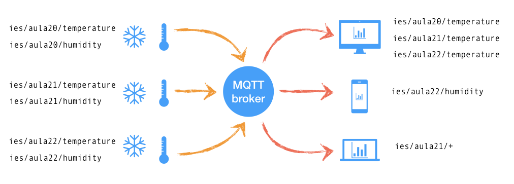
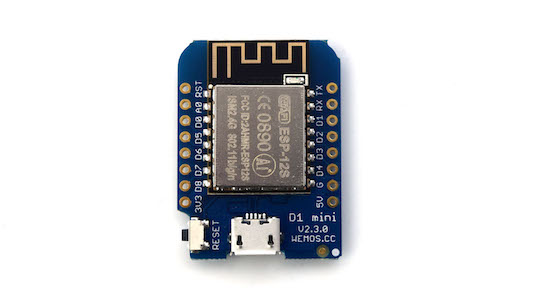
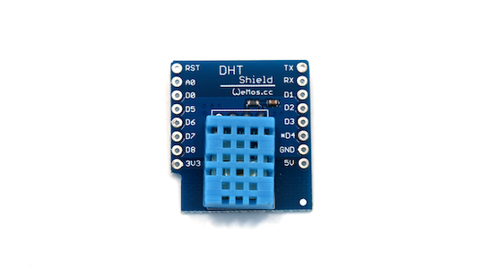
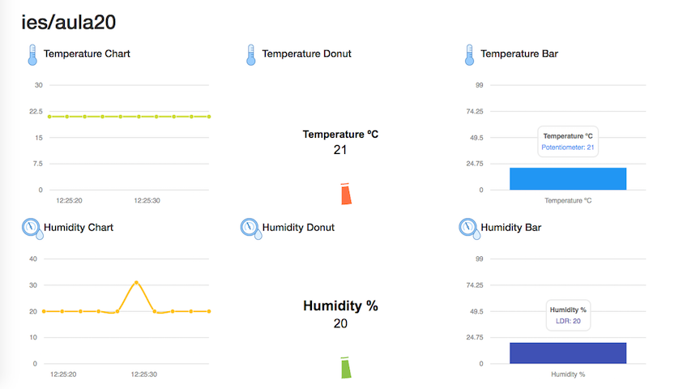

# iot-demo

## Descripción del proyecto

En cada aula del instituto vamos a tener un [Wemos D1 mini][4] y un [sensor de temperatura/humedad DHT11][5] que va a ir tomando medidas de forma constante y las va a ir publicando en un [*broker* MQTT][2]. También existirán otros dispositivos y aplicaciones que estarán suscritas a los *topics* del [*broker* MQTT][2] donde se publican los valores recogidos por los sensores. Podríamos seguir la siguiente estructura de nombres para los *topics* del edificio:

```
ies/aula<número>/temperature
ies/aula<número>/humidity
```

Por ejemplo para el `aula20` tendríamos los siguientes *topics*:

```
ies/aula20/temperature
ies/aula20/humidity
```

## Diagrama



## Hardware

### Wemos D1 mini



Puedes encontrar [más información en la documentación oficial][4].

### Sensor de temperatura/humedad DHT11



Puedes encontrar [más información en la documentación oficial][6].

## Wemos D1 mini

### Lectura del sensor de temperatura/humedad DHT11

Vamos a hacer uso de la librería de [Adafruit DHT][8] para trabajar con los [sensores DHT11][5]. Podemos usar el siguiente código de ejemplo:

```c++
#include "DHT.h"

#define DHTPIN D4
#define DHTTYPE DHT11

DHT dht(DHTPIN, DHTTYPE);

void setup() {
  Serial.begin(115200);
  Serial.println("IoT demo");
  dht.begin();
}

void loop() {
  delay(2000);

  float h = dht.readHumidity();
  float t = dht.readTemperature();

  if (isnan(h) || isnan(t)) {
    Serial.println("Failed to read from DHT sensor!");
    return;
  }

  Serial.print("Humidity: ");
  Serial.print(h);
  Serial.print(" %\t");
  Serial.print("Temperature: ");
  Serial.print(t);
  Serial.println(" *C ");
}
```

[Ver el código fuente](wemos-d1-mini/dht11)

### Cómo obtener la dirección MAC de un Wemos D1 mini

En las aulas estamos usando filtrado por MAC, por lo que será necesario conocer la dirección MAC de nuestros dispositivos [Wemos D1 mini][4]. Podemos usar el siguiente código de ejemplo:

```c++
#include <ESP8266WiFi.h>
 
void setup() {
    delay(500);
    Serial.begin(115200);
    Serial.print("MAC: ");
    Serial.println(WiFi.macAddress());
}
 
void loop() {

}
```

[Ver el código fuente](wemos-d1-mini/wifi_static_ip)

### Configuración WiFi

El servicio de DHCP está desactivado en los puntos de acceso WiFi por lo que tendremos que asignar una dirección IP estática a cada uno de los dispostivos [Wemos D1 mini][4]. Por ejemplo, para la siguiente configuración de red:

* WiFi SSID: `AULA20`
* WiFi Password: `aula20`
* IP: `192.168.1.10`
* Puerta de enlace: `192.168.1.1`
* Máscara de red: `255.255.255.0`

Utilizaríamos el siguiente código:

```c++
#include <ESP8266WiFi.h>

#define WLAN_SSID       "AULA20"
#define WLAN_PASS       "aula20"

IPAddress ip(192, 168, 1, 10);
IPAddress gateway(192, 168, 1, 1);
IPAddress subnet(255, 255, 255, 0);

WiFiClient client;

//----------------------------------------------

void connectWiFi() {
  WiFi.config(ip, gateway, gateway, subnet);
  WiFi.begin(WLAN_SSID, WLAN_PASS);
  while (WiFi.status() != WL_CONNECTED) {
     delay(500);
     Serial.print(".");
  }

  Serial.println("WiFi connected");
  Serial.println("IP address: ");
  Serial.println(WiFi.localIP());
}

//----------------------------------------------

void setup() {
  Serial.begin(115200);
  connectWiFi();
}

void loop() {

}
```

[Ver el código fuente](wemos-d1-mini/wifi_static_ip)

### Configuración para publicar datos en el *broker* MQTT

Vamos a hacer uso de la librería [Adafruit MQTT][7] para conectar con el *broker* MQTT y publicar los datos que vamos obteniendo de los [sensores DHT11][5]. En nuestro caso vamos a tener la siguiente configuración de red:

* WiFi SSID: `AULA20`
* WiFi Password: `aula20`
* IP: `192.168.1.10`
* Puerta de enlace: `192.168.1.1`
* Máscara de red: `255.255.255.0`

Y la configuración del *broker* MQTT será la siguiente:

* Servidor MQTT: `192.168.1.200`
* Puerto MQTT: `1883`
* Topic para los valores de temperatura: `ies/aula20/temperature`
* Topic para los valores de humedad: `ies/aula20/humidity`

En este ejemplo no vamos a proteger el acceso al *topic* con usuario y contraseña.

```c++
#include "DHT.h"
#include <ESP8266WiFi.h>
#include "Adafruit_MQTT.h"
#include "Adafruit_MQTT_Client.h"

#define DHTPIN D4
#define DHTTYPE DHT11

DHT dht(DHTPIN, DHTTYPE);

#define WLAN_SSID       "AULA20"
#define WLAN_PASS       "aula20"

IPAddress ip(192, 168, 1, 10);
IPAddress gateway(192, 168, 1, 1);
IPAddress subnet(255, 255, 255, 0);

#define MQTT_SERVER      "192.168.1.200"
#define MQTT_SERVERPORT  1883
#define MQTT_USERNAME    ""
#define MQTT_KEY         ""
#define MQTT_FEED_TEMP   "ies/aula20/temperature"
#define MQTT_FEED_HUMI   "ies/aula20/humidity"

WiFiClient client;

Adafruit_MQTT_Client mqtt(&client, MQTT_SERVER, MQTT_SERVERPORT, MQTT_USERNAME, MQTT_USERNAME, MQTT_KEY);

Adafruit_MQTT_Publish temperatureFeed = Adafruit_MQTT_Publish(&mqtt, MQTT_FEED_TEMP);

Adafruit_MQTT_Publish humidityFeed = Adafruit_MQTT_Publish(&mqtt, MQTT_FEED_HUMI);

//----------------------------------------------

void connectWiFi();

//----------------------------------------------

void setup() {
  Serial.begin(115200);
  Serial.println("IoT demo");
  dht.begin();
  connectWiFi();
  connectMQTT();
}

//----------------------------------------------

void loop() {
  delay(2000);

  float h = dht.readHumidity();
  float t = dht.readTemperature();

  if (isnan(h) || isnan(t)) {
    Serial.println("Failed to read from DHT sensor!");
    return;
  }

  Serial.print("Humidity: ");
  Serial.print(h);
  Serial.print(" %\t");
  Serial.print("Temperature: ");
  Serial.print(t);
  Serial.println(" *C ");

  temperatureFeed.publish(t);
  humidityFeed.publish(h);
}

//----------------------------------------------

void connectWiFi() {
  WiFi.config(ip, gateway, gateway, subnet);
  WiFi.begin(WLAN_SSID, WLAN_PASS);
  while (WiFi.status() != WL_CONNECTED) {
     delay(500);
     Serial.print(".");
  }

  Serial.println("WiFi connected");
  Serial.println("IP address: ");
  Serial.println(WiFi.localIP());
}

//----------------------------------------------

void connectMQTT() {
  if (mqtt.connected())
    return;

  Serial.print("Connecting to MQTT... ");
  while (mqtt.connect() != 0) {
       Serial.println("Error. Retrying MQTT connection in 5 seconds...");
       mqtt.disconnect();
       delay(5000);
  }
}
```

[Ver el código fuente](wemos-d1-mini/mqtt)

## MQTT *broker*

### `Vagrantfile` para la máquina virtual

Vamos a utilizar una **máquina virtual** con *Ubuntu Xenial64* para nuestro [*broker* MQTT][2]. Este podría ser el archvivo `Vagrantfile` con la configuración de la máquina virtual:

```ruby
# -*- mode: ruby -*-
# vi: set ft=ruby :

Vagrant.configure("2") do |config|
  config.vm.box = "ubuntu/xenial64"
  config.vm.network "public_network", ip: "192.168.1.200"

  config.vm.provision "shell", inline: <<-SHELL
     apt-get update
     apt-get install -y mosquitto mosquitto-clients
  SHELL
end
```

[Ver el archivo `Vagrantfile`](mqtt-broker/Vagrantfile)

### Instalación

Vamos a instalar [mosquitto][1], un  *broker* [MQTT][2] *open source* usado para la comunicación entre dispositivos en el [IoT][3].

```bash
sudo apt-get install -y mosquitto mosquitto-clients
```

### Configuración

Configuramos [mosquitto][1] para que acepte conexiones de red desde cualquier interfaz del servidor. Editamos el archivo:

```
/etc/mosquitto/mosquitto.conf 
```

y añadimos la siguiente línea:

```
bind_address 0.0.0.0
```

### Publicar mensajes en un *topic*

``` 
mosquitto_pub -h <host> -t <topic> -m <mensaje>
```

Por ejemplo, el comando:

``` 
mosquitto_pub -h 192.168.1.200 -t ies/aula20/temperature -m "hello world!"
```

Publica el mensaje `"hello world!"` en el topic `ies/aula20/temperature` en el [MQTT][2] *broker* que está en la IP `192.168.1.200`.

### Suscribirse a un *topic* 

```
mosquitto_sub -h <host> -t <topic>
```

Por ejemplo, el comando:

```
mosquitto_sub -h 192.168.1.200 -t ies/aula20/temperature
```

Se suscribe al topic `ies/aula20/temperature` que está en el [MQTT][2] *broker* con dirección IP `192.168.1.200`.

## Cliente MQTT

## *Dashboard*

Como cliente [MQTT][2] vamos a tener una nueva **máquina virtual** que se va a suscribir a los *topics* del *broker* [MQTT][2] y va a mostrar los valores de los sensores en un panel de control web como el que se muestra a continuación. La dirección IP de la máquina virtual será la `192.168.1.100` y tendrá un **servidor web** con [node.js][9] en el puerto `3000`.



### `Vagrantfile` para la máquina virtual del *dashboard*

Vamos a utilizar una **máquina virtual** con *Ubuntu Xenial64* para nuestro [servidor web con node.js][9] que va a alojar el *dashboard*. Este podría ser el archvivo `Vagrantfile` con la configuración de la máquina virtual:

```ruby
# -*- mode: ruby -*-
# vi: set ft=ruby :

Vagrant.configure("2") do |config|
  config.vm.box = "ubuntu/xenial64"

  config.vm.network "public_network", ip: "192.168.1.100"
  config.vm.provision "shell", inline: <<-SHELL
    apt-get update
    apt-get install -y nodejs
    apt-get install -y npm
    cd /vagrant/web
    npm install
  SHELL
end
```

### Servidor web con node.js

[Ver el código fuente del servidor web con node.js](mqtt-client/dashboard/web)

## Autor

Este material ha sido desarrollado por [José Juan Sánchez](http://josejuansanchez.org).

## Licencia

<a rel="license" href="http://creativecommons.org/licenses/by-sa/4.0/"></a><br />Esta obra está bajo una <a rel="license" href="http://creativecommons.org/licenses/by-sa/4.0/">licencia de Creative Commons Reconocimiento-CompartirIgual 4.0 Internacional</a>.

[1]: https://mosquitto.org
[2]: http://mqtt.org
[3]: https://es.wikipedia.org/wiki/Internet_de_las_cosas
[4]: https://wiki.wemos.cc/products:d1:d1_mini
[5]: https://learn.adafruit.com/dht/overview
[6]: https://wiki.wemos.cc/products:retired:dht_shield_v1.0.0?s[]=temperature
[7]: https://github.com/adafruit/Adafruit_MQTT_Library
[8]: https://github.com/adafruit/DHT-sensor-library
[9]: https://nodejs.org/es/